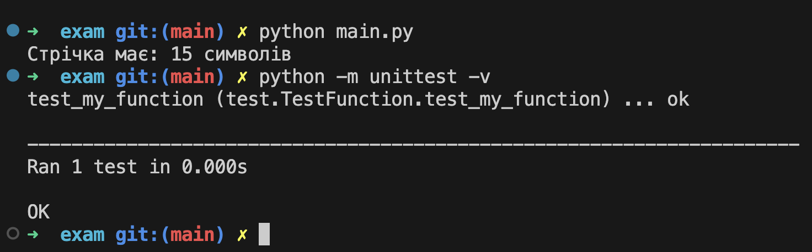

# Приклад Екзамена
- створюєте окрему папку exam у репозиторії з двома файлами main.py та test.py
- у першому файлі main.py потрібно буде створити функцію, у кожного індивідуальне завдання.
- у другому файлі test.py потрібно написати Unit тест для перевірки роботи функції.
- запустити програму у main.py та запустити тестування.

## Приклад виконання
- запускаємо програму:
  ```bash
  python main.py
  ```
- запускаємо тести:
```bash
python -m unittest -v
```
- результат

